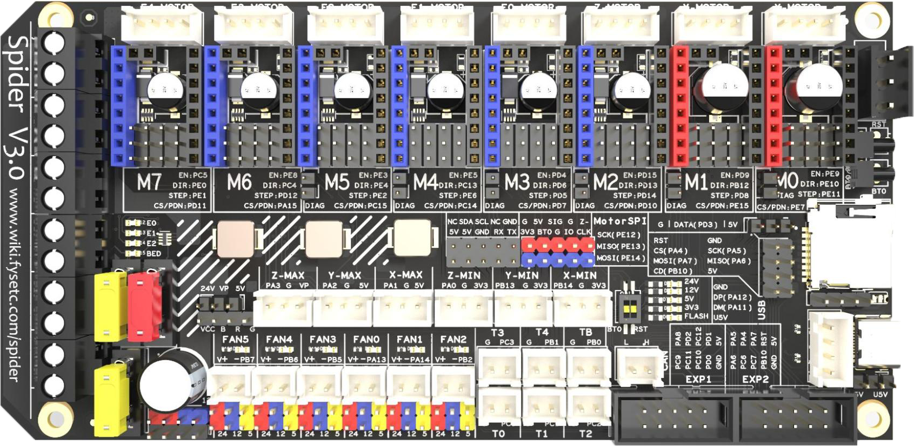

# Spider V3.0

## GitHub



<figure><figcaption></figcaption></figure>

## Pros

* CAN support
* Selectable fan voltage
* Driver pin configuration
* 48v support
* Dimensions: 135x200mm
* Common STM32F446 MCU

## Cons

* Lack of documentation

## &#x20;Ports

* 8 stepper driver
* 3x extruder heater
* Bed in/out
* 6x fan
* 6x endstop
* 6x thermistor
* Can port
* EXP1+EXP2
* 48v port
* Rpi communication pins
* BL Touch
* LEDs
* External 5V
* SPI ports

## Stores

We've added some of the stores to the Sourcing Guide [here](../../../resources/sourcing-guide.md#spider-v3.0).

