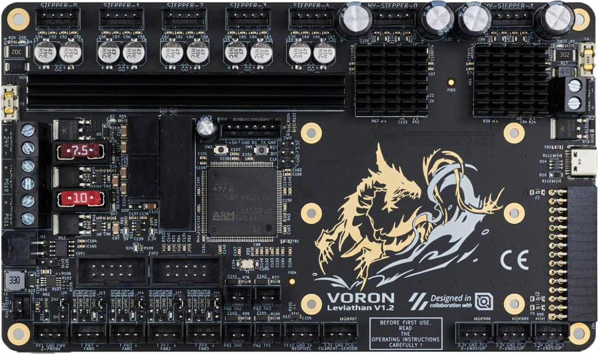

# BigTreeTech Kraken

## GitHub



<figure><figcaption></figcaption></figure>

## Pros

* STM32H723
* 60v support
* Dimensions: 200x113mm
* 8A motor ports
* Dual CAN support
* 5v dedicated RPI psu
* Comes with limited edition BTT Black ducky
* Good documentation  &#x20;

## Cons

* Integrated Stepper Drivers
* Very large

## Ports

* Onboard TMC2160, support 24-60V, Max 8A driving current for M1-M4, Max 3A for M5-M8
* 8x motor ports
* 5x motor fan ports
* Bed ports
* Motor port
* Power port
* 4x hotend ports
* 6x DC fan ports
* 2x 4 pin fan ports
* 8x endstops
* Probe(Servos, Probe)
* Servo
* Filament Sensor
* PS-ON
* I2C
* 2x RGB
* SPI
* UART interface
* EXP1+EXP2
* 2x CAN,
* 2x PT100/PT1000
* USB-A 5V Power

## Stores

We've added some of the stores to the Sourcing Guide [here](bigtreetech-kraken.md).

