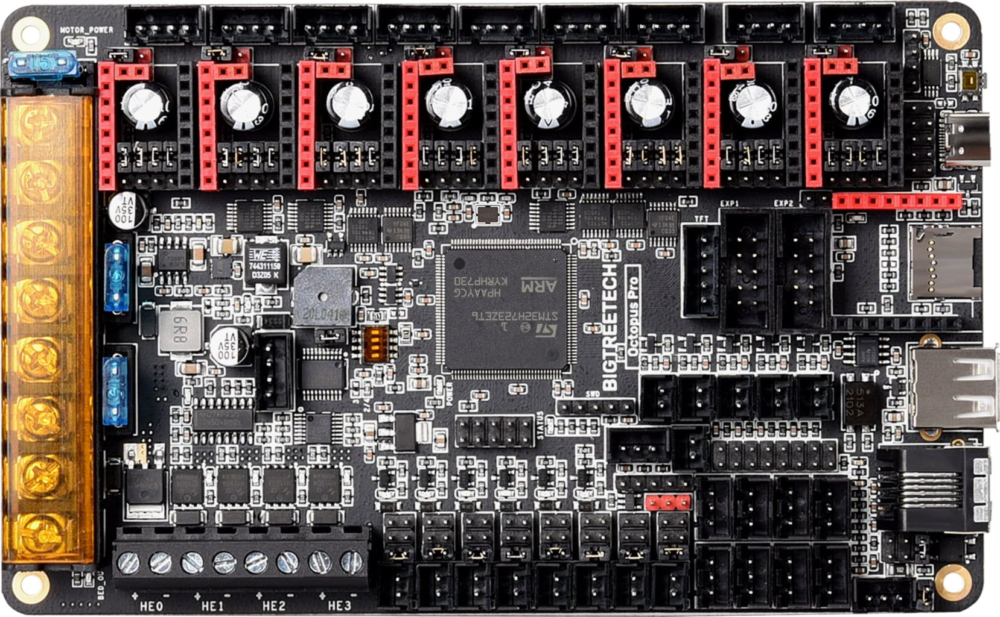

# BigTreeTech Octopus Pro

## GitHub



<figure><figcaption></figcaption></figure>

## Pros

* Best community support
* Good docs
* Dimensions: 160x100mm
* Common STM32F446 MCU option
* High speed STM32H723 MCU option
* CAN support
* 48v support

## Cons

* TBD

## Ports

* 8x stepper drivers
* 1x z sync port on driver 3
* IIC
* Motor power
* Power
* Bed Port
* PT100/PT1000
* 4x Hotend ports
* SPI3
* 8x Fan ports
* BL Touch
* LED
* Probe Port
* 8x endstop ports
* 5x thermistor ports
* CAN interface
* Power detection port
* PS On
* EXP1+EXP2
* BootO
* UART2

## Stores

We've added some of the stores to the Sourcing Guide [here](bigtreetech-octopus-pro.md).

