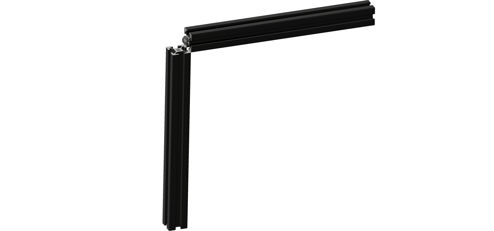
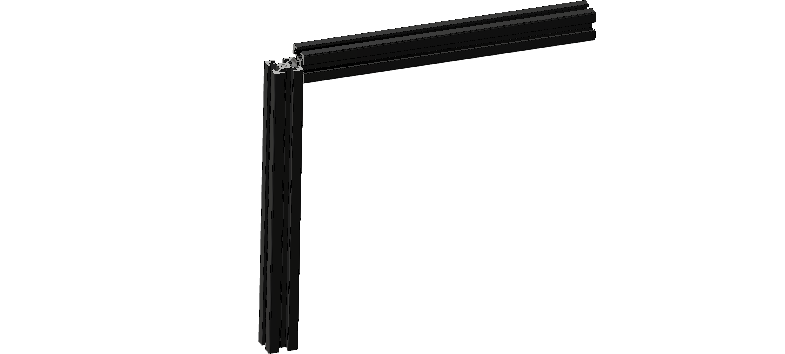
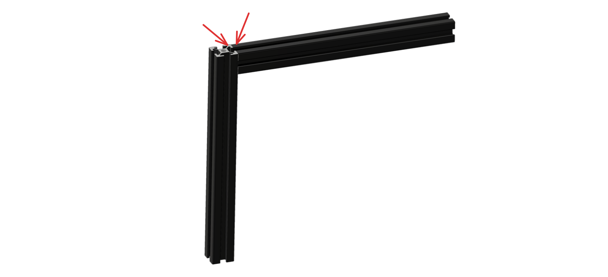
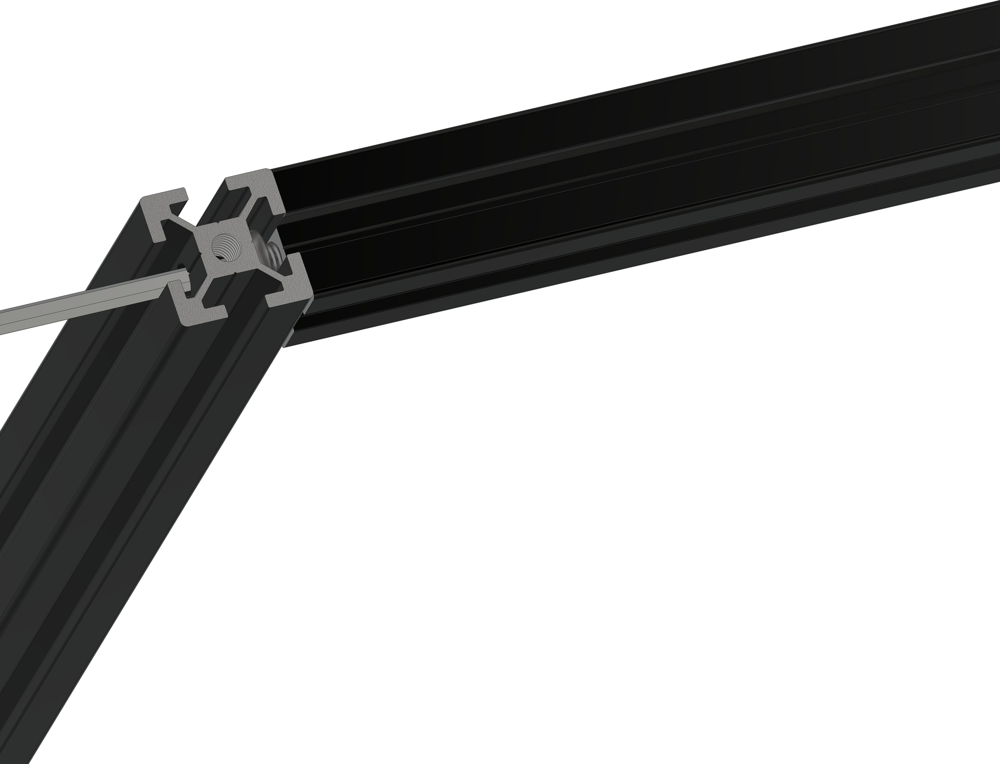

# Blind joints, how do they work?


The page will be updated with detailed information in the future. We have included the basic details for now to make sure we have some information on the website.


## What is a Blind Joint?

A blind joint on an extrusion involves a through hole on the side of the extrusion. This hole will be used to tighten a bolt that will screw together with another piece of extrusion. This other piece most likely has a threaded hole on the end.

This setup secures two extrusions at a right angle without exposing any parts externally, providing a clean look and robust connection.

## Enlarging images

Click the image to enlarge them, giving you a more detailed view.

## How do they work



### Take a threaded extrusion

Insert a bolt (depending on the frame size) into the threaded part of the extrusion.




### Screw bolt in

Leave 2.5 to 3mm of space between the bolt head and the extrusion end. This helps in sliding another extrusion on later.




### Slide in extrusion

Slide another piece of extrusion over the bolt we just added.

Here is another view of the extrusion sliding over the bolt.




### Making sure the surface is Flush

Ensure the surfaces are perfectly aligned. This is crucial, especially when we're trying to get a square frame.

See the red arrows: one shows a cut surface, the other the extrusion's side. Place this on a flat surface and find the edge on the mating surfaces with your fingers to align them. Keep them aligned for the next step.




### Tightening the bolt

Ensure the surfaces remain flush and tighten the bolt further. This will strengthen the 'blind joint' connection.

Great job! You've successfully created a blind joint. Congratulations!



