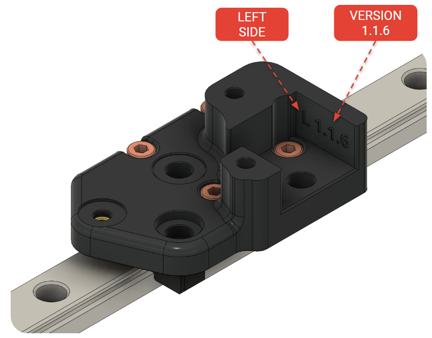
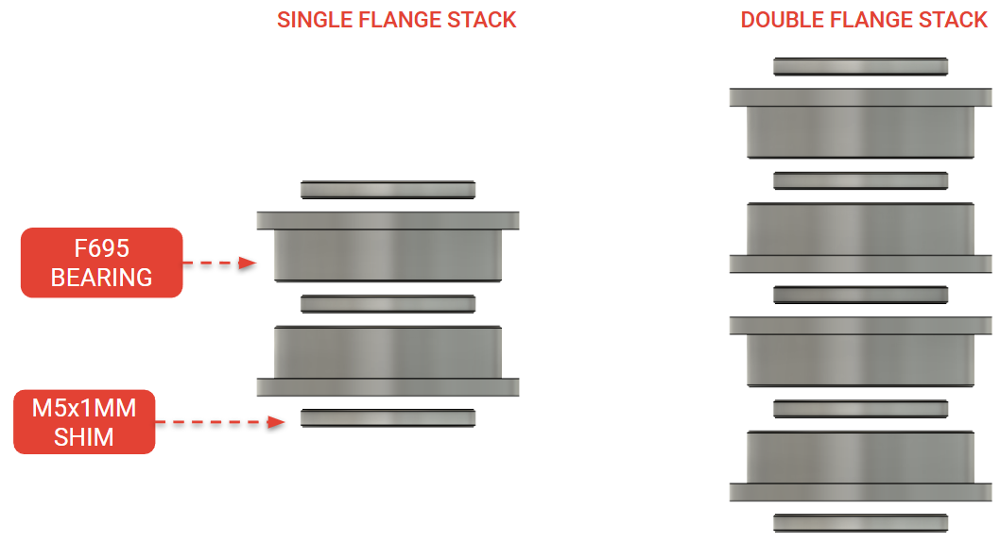
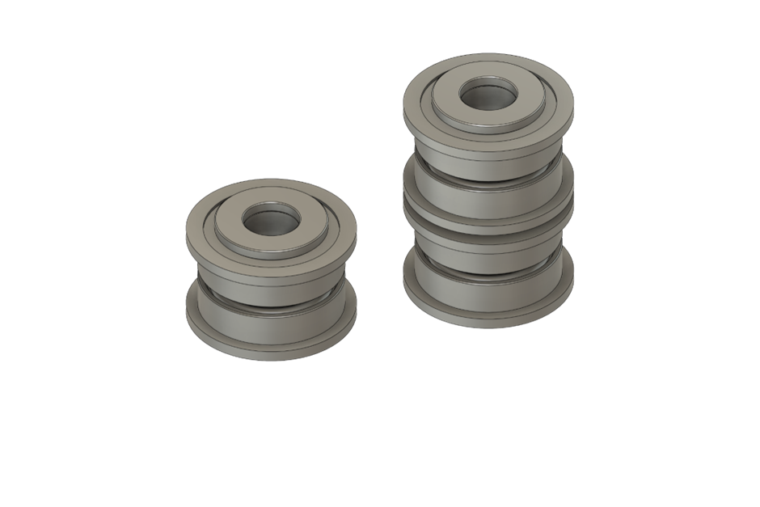
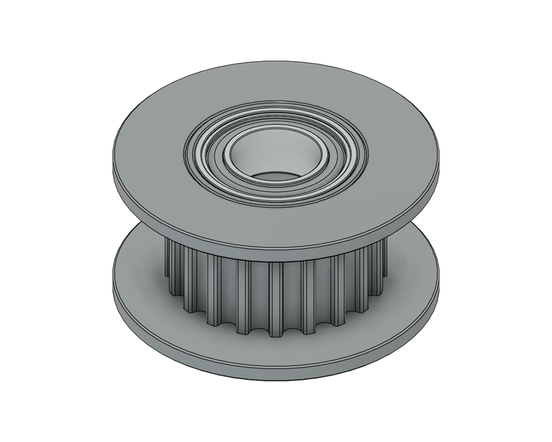

# Concepts

## <mark style="color:red;">Printed part codes</mark>

Our parts have printed codes to aid assembly.

1. A part code identifies
   1. If the part belongs on the **left (‘L’)** or **right (‘R’)** side of the printer.
   2. The **version** of the part.

<figure><figcaption></figcaption></figure>

## <mark style="color:red;">Flange Stacks</mark>

Flange stacks (along with 5x30mm dowel pins) are used to create smooth idlers.


Quality idlers, smooth and toothed, are key for your printer's performance. We use flange stacks throughout assembly.


Single flange stacks use

* [**three (3)** shims](#user-content-fn-1)[^1] and [**two (2)** bearings](#user-content-fn-2)[^2].

Double stacks uses

* [**five (5**) shims](#user-content-fn-3)[^3] and [**four (4)** bearings](#user-content-fn-4)[^4].

<figure><figcaption></figcaption></figure>

## <mark style="color:red;">Types of Idlers</mark>

### <mark style="color:red;">Smooth Idlers</mark>

[Smooth idlers](#user-content-fn-5)[^5] are the most common idler that we will use; they turn the belt around its smooth side.

A **single flange stack** has **one (1)** smooth idler; a **double flange stack** has **two (2)**.

<figure><figcaption></figcaption></figure>

### <mark style="color:red;">Toothed Idlers</mark>

**Toothed idlers** are used on the **X joints only**. These are used when the belt turns towards its toothed side.

<figure><figcaption></figcaption></figure>

[^1]: M5X1MM

[^2]: F695 BEARING

[^3]: M5X1MM

[^4]: F695 BEARING

[^5]: Revering to one step up, this is our definition of Smooth Idlers.
