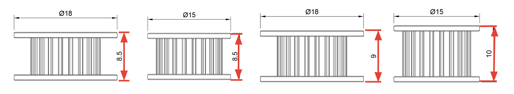
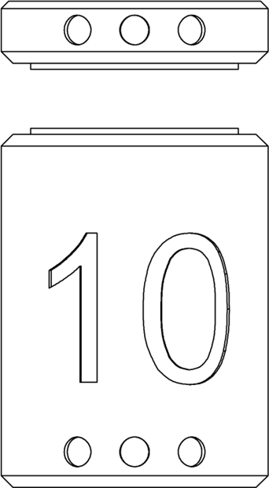
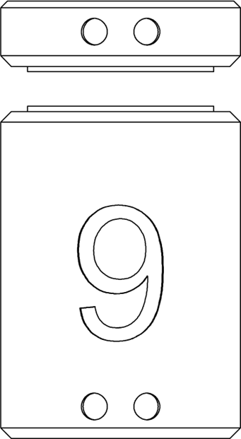
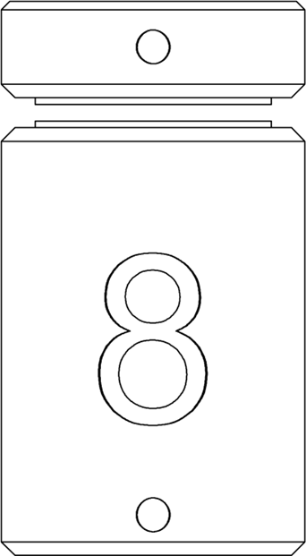

# Printing

## Printing / Files

A complete Mercury One.1 build includes both the Mercury One motion system and a compatible toolhead of your choice. Our stock, supported toolhead is a modified EVA 2.4.


Our file configurator will be redone and ported to a new page in the future.


Our doc site has Configurator tools for both Mercury One.1 and EVA 2.4. The Configurators generate ZIP files that are customized to your configuration and contain all of the files to print:[ https://docs.zerog.one/manual/build/mercury\_eva/printed\_files](https://docs.zerog.one/manual/build/mercury_eva/printed_files).

Alternatively, you can browse and download the files directly from GitHub[ here for Mercury One.1](https://github.com/ZeroGDesign/docs/tree/gh-pages/docs/assets/stl/m1_1) and[ here for EVA 2.4](https://github.com/ZeroGDesign/docs/tree/gh-pages/docs/assets/stl/eva2_4).

***

## Measure your toothed idler

We support several types of toothed idlers. To find the correct spacers, measure your idler’s height and check the next page for the corresponding spacers.

<figure><figcaption></figcaption></figure>

***

## Find your spacer

Print the matching spacer to your idler’s height. Each spacer has one (1) dot[^1] for 8.5mm, two (2) for 9mm, and three (3) for 10mm.

The Configurator should include the correct file for you, but we’ve also included direct links below.

<table data-view="cards"><thead><tr><th>Size</th><th>Link / Name</th><th>Image</th><th data-hidden data-card-cover data-type="files"></th></tr></thead><tbody><tr><td>10mm</td><td><a href="https://github.com/ZeroGDesign/docs/blob/gh-pages/docs/assets/stl/m1_1/a_Xjoint_10mm_Idler_Spacers.stl">a_Xjoint_10mm_Idler_Spacers.stl</a></td><td></td><td></td></tr><tr><td>9mm</td><td><a href="https://github.com/ZeroGDesign/docs/blob/gh-pages/docs/assets/stl/m1_1/a_Xjoint_9mm_Idler_Spacers.stl">a_Xjoint_9mm_Idler_Spacers.stl</a></td><td></td><td></td></tr><tr><td>8.5mm</td><td><a href="https://github.com/ZeroGDesign/docs/blob/gh-pages/docs/assets/stl/m1_1/a_Xjoint_8mm_Idler_Spacers.stl">a_Xjoint_8mm_Idler_Spacers.stl</a></td><td></td><td></td></tr></tbody></table>

[^1]: The printed spacers include a small dot in the bottom that'll tell you the size so you don't lose track.
