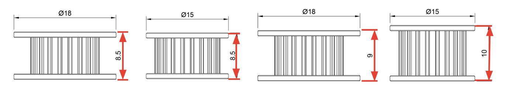
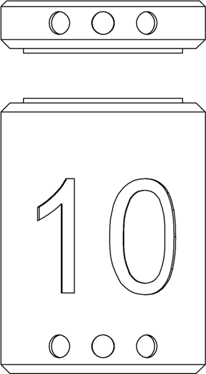
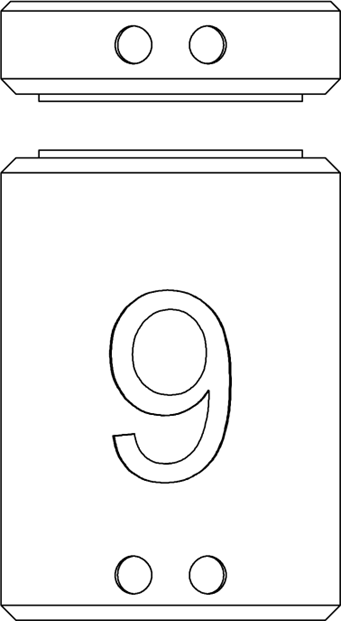
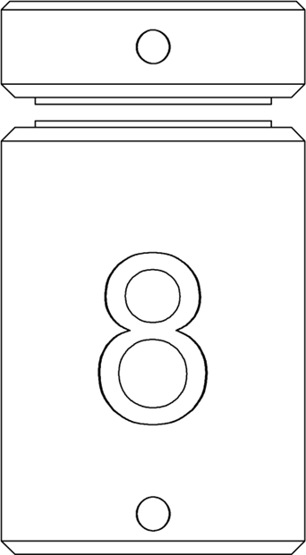

# Printing

## <mark style="color:red;">Measuring parts</mark>

We're going to measure some parts to make sure you've got the correct files to print. This is highly important to make sure pulleys and idlers move smoothly.

### <mark style="color:red;">Measure your toothed idler</mark>

We support several types of toothed idlers. To find the correct spacers, measure your idler’s height and check the next page for the corresponding spacers.

<figure><figcaption></figcaption></figure>

### <mark style="color:red;">Find your spacer</mark>

Print the matching spacer to your idler’s height. Each spacer has one (1) dot[^1] for 8.5mm, two (2) for 9mm, and three (3) for 10mm.

The Configurator should include the correct file for you, but we’ve also included direct links below.


Once measured, the tabs below will tell you what the printed spacer should look like, if it's hard to see click the image to enlarge it.


<strong>10mm</strong>

**You measured 10mm**

[a\_Xjoint\_10mm\_Idler\_Spacers.stl](https://github.com/ZeroGDesign/docs/blob/gh-pages/docs/assets/stl/m1_1/a_Xjoint_10mm_Idler_Spacers.stl)

Here is an example of the printed spacer you need

<strong>9mm</strong>

**You measured 9mm**

[a\_Xjoint\_9mm\_Idler\_Spacers.stl](https://github.com/ZeroGDesign/docs/blob/gh-pages/docs/assets/stl/m1_1/a_Xjoint_9mm_Idler_Spacers.stl)\
Here is an example of the printed spacer you need

<strong>8.5mm</strong>

**You measured 8.5mm**

[a\_Xjoint\_8mm\_Idler\_Spacers.stl](https://github.com/ZeroGDesign/docs/blob/gh-pages/docs/assets/stl/m1_1/a_Xjoint_8mm_Idler_Spacers.stl)

Here is an example of the printed spacer you need

***

## <mark style="color:red;">Tapped or T-Nut Tensioner plate?</mark> 

If you see this, I forgot to do it lol

## <mark style="color:red;">Recommended print settings</mark> 

* First layer height: 0.25mm (This is required. Our parts have been designed for this.)
* Layer height: 0.2mm
* Extrusion width: 0.4mm, forced
* Infill percentage: 40%
* Infill type: Adaptive Cubic, grid, gyroid, honeycomb, triangle, or cubic
* Wall count: 4
* Solid top/bottom layers: 5
* Seam placement: **REAR**
  * This is important as we have seam relieve features that line up with the seam placement.
* Supports: NONE


Over-extrusion leads to top layers with an inconsistent finish and/or blobbing. Check the top surfaces on the stepper towers and X joints, as these are mating faces.

Light sanding with sandpaper can help remove rough surfaces and ensure a proper fit between parts.


[^1]: The printed spacers include a small dot in the bottom that'll tell you the size so you don't lose track.
