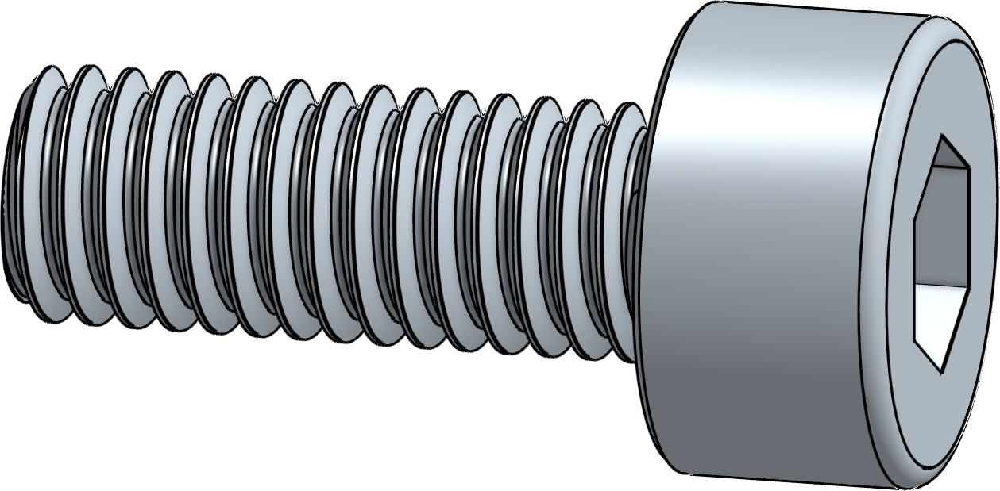
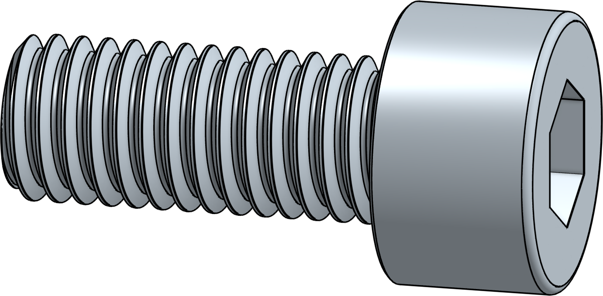
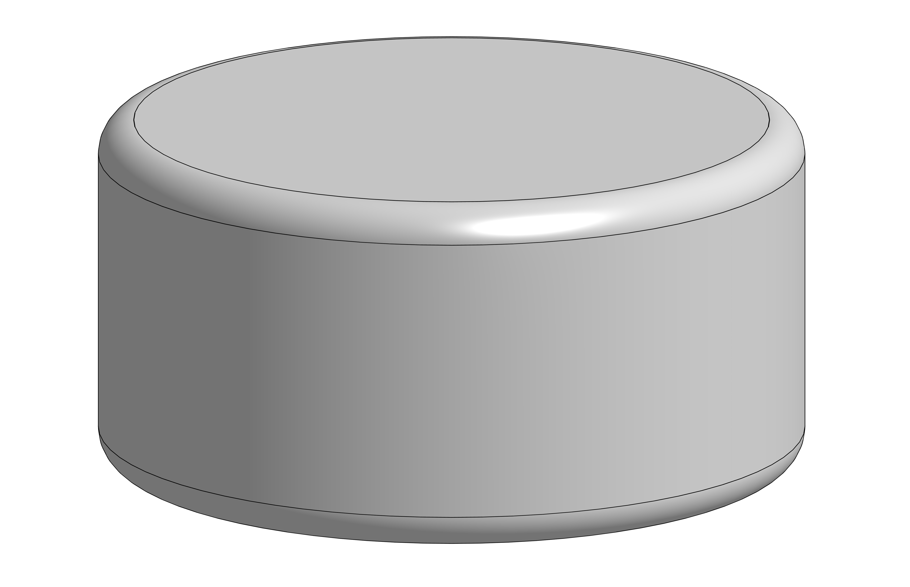
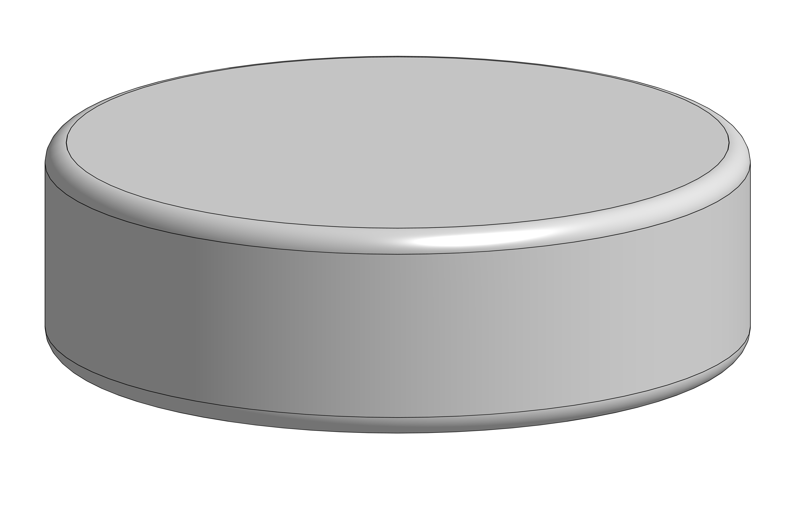

# Bill of Material

## Kits 

We **do not** own the kits. We’re **not responsible** for these kits. **Make sure to check the included hardware**. There are kits might not contain all the hardware needed.

#### All kits 

| Type                     | Stores     |
| ------------------------ | ---------- |
| Nebula kit by LDO Motors | Click here |

## Self sourcing 


The Bill of Materials DOES include all hardware to build the electronics-bay as well.



Keep in mind these numbers do not include spares, it might be wise to buy some spares.


### Bolts 

#### **Self sourcing bolts**

<table><thead><tr><th width="146">Size</th><th>Type</th><th width="100">Amount</th><th width="144">Image</th><th>Stores</th></tr></thead><tbody><tr><td>M3x8</td><td>FHCS</td><td>2</td><td></td><td>Click here   </td></tr><tr><td>M3x8</td><td>BHCS</td><td>36</td><td></td><td>Click here   </td></tr><tr><td>M3x8</td><td>SHCS</td><td>38</td><td></td><td><a href="https://app.gitbook.com/s/c7rngz4fr0ULXRXV6Dnh/resources/sourcing-guide#m3-x-8mm-shcs">Click here</a>   </td></tr><tr><td>M3x12</td><td>SHCS</td><td>46</td><td></td><td><a href="https://app.gitbook.com/s/c7rngz4fr0ULXRXV6Dnh/resources/sourcing-guide#m3-x-12mm-shcs">Click here</a>   </td></tr><tr><td>M3x14</td><td>SHCS</td><td>8</td><td></td><td>Click here   </td></tr><tr><td>M5x6</td><td>BHCS</td><td>8</td><td></td><td><a href="https://docs.zerog.one/manual/build/hydra/bill_of_material#m5x10_912">Click here</a>   </td></tr><tr><td>M5x10</td><td>BHCS</td><td>66</td><td></td><td>Click here </td></tr><tr><td>M5x10</td><td>FHCS</td><td>6</td><td></td><td>Click here </td></tr><tr><td>M5x12</td><td>SHCS</td><td>4</td><td></td><td><a href="https://app.gitbook.com/s/c7rngz4fr0ULXRXV6Dnh/resources/sourcing-guide#m5-x-12mm-shcs">Click here </a></td></tr><tr><td>M5x18</td><td>SHCS</td><td>14</td><td></td><td>Click here </td></tr></tbody></table>

### Nuts 

<table><thead><tr><th>Size</th><th>Type</th><th width="108">Amount</th><th>Image</th><th>Stores</th></tr></thead><tbody><tr><td>M3</td><td>Roll in spring loaded</td><td>106</td><td></td><td><a href="https://docs.zerog.one/manual/build/hydra/bill_of_material#m3_rollin_tnut">Click here</a>   </td></tr><tr><td>M5</td><td>Roll in spring loaded</td><td>52</td><td></td><td><a href="https://docs.zerog.one/manual/build/hydra/bill_of_material#m5_rollin_tnut">Click here</a>   </td></tr><tr><td>M5</td><td>Hex Nut</td><td>4</td><td></td><td>Click here</td></tr></tbody></table>

### Dowel Pins 



<table><thead><tr><th>Size</th><th width="108">Amount</th><th>Image</th><th>Stores</th></tr></thead><tbody><tr><td>5x50 pin</td><td>3</td><td></td><td>Click here   </td></tr></tbody></table>



<table><thead><tr><th>Size</th><th width="108">Amount</th><th>Image</th><th>Stores</th></tr></thead><tbody><tr><td>5x50 pin</td><td>6</td><td></td><td>Click here   </td></tr></tbody></table>



### Bushings



<table><thead><tr><th>Size</th><th width="108">Amount</th><th>Image</th><th>Stores</th></tr></thead><tbody><tr><td>5x7x8mm Bushing</td><td>6</td><td></td><td>Click here   </td></tr></tbody></table>



<table><thead><tr><th>Size</th><th width="108">Amount</th><th>Image</th><th>Stores</th></tr></thead><tbody><tr><td>5x7x8mm Bushing</td><td>12</td><td></td><td>Click here   </td></tr></tbody></table>



### Magnets



<table><thead><tr><th>Size</th><th width="108">Amount</th><th>Image</th><th>Stores</th></tr></thead><tbody><tr><td>6x3</td><td>36 x</td><td></td><td>Click here   </td></tr><tr><td>10x3</td><td>16 </td><td></td><td>Click here  </td></tr></tbody></table>



<table><thead><tr><th>Size</th><th width="108">Amount</th><th>Image</th><th>Stores</th></tr></thead><tbody><tr><td>6x3</td><td>36</td><td></td><td>Click here   </td></tr><tr><td>10x3</td><td>48</td><td></td><td>Click here  </td></tr></tbody></table>


