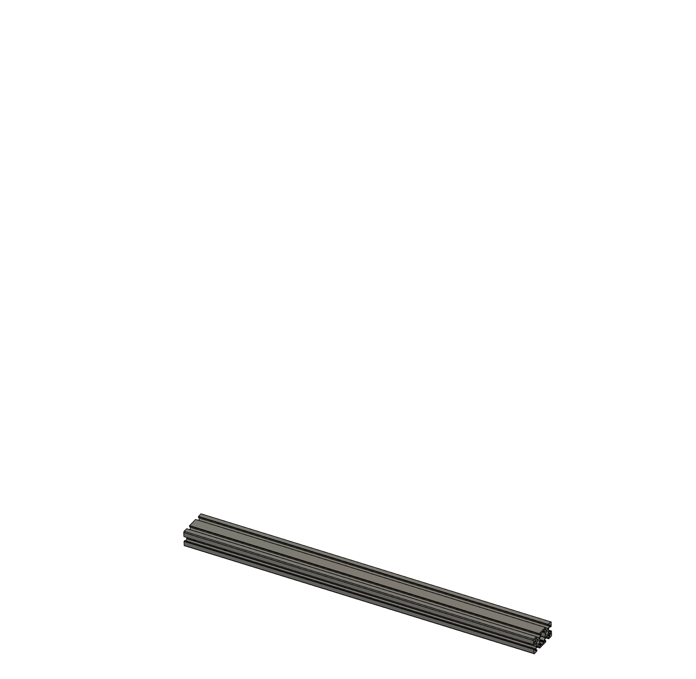
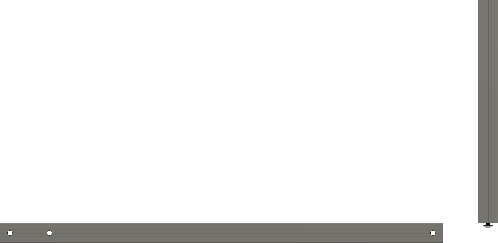

---
layout:
  title:
    visible: true
  description:
    visible: false
  tableOfContents:
    visible: true
  outline:
    visible: true
  pagination:
    visible: true
---

# Building the side frame

Now we will build the right side of the frame.

<figure><figcaption>
Above is an overview of the entire assembly.
</figcaption></figure>

|   | QTY. | Nebula 255 | Nebula 370 |
| - | ---- | ---------- | ---------- |
| A | 4x   | 2020 650mm | 2020 800mm |
| B | 2x   | 2020 450mm | 2020 600mm |
| C | 2x   | 2040 450mm | 2040 600mm |
| D | 2x   | 2020 410mm | 2020 560mm |
| E | 2x   | 2020 410mm | 2020 538mm |
| F | 4x   | 2040 400mm | 2040 510mm |
| G | 1x   | 2020 400mm | 2020 510mm |
| H | 2x   | 2020 370mm | 2020 498mm |
| I | 3x   | 2020 370mm | 2020 498mm |

<figure><figcaption>
Insert two M5x10 BHCS into the bottom of each upright assembled previously. Then, slide each upright over Extrusion B.
</figcaption></figure>
