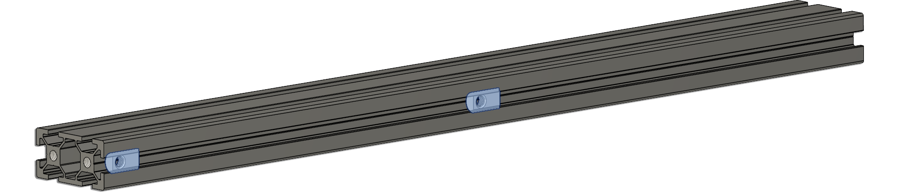
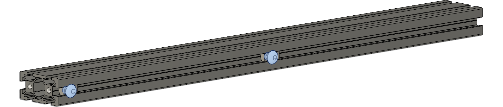
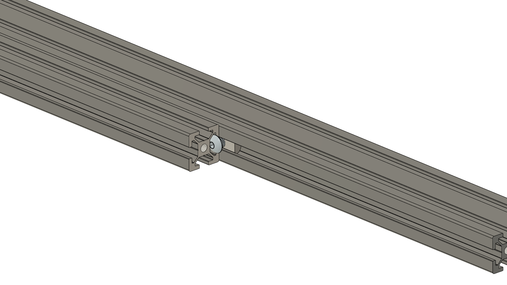
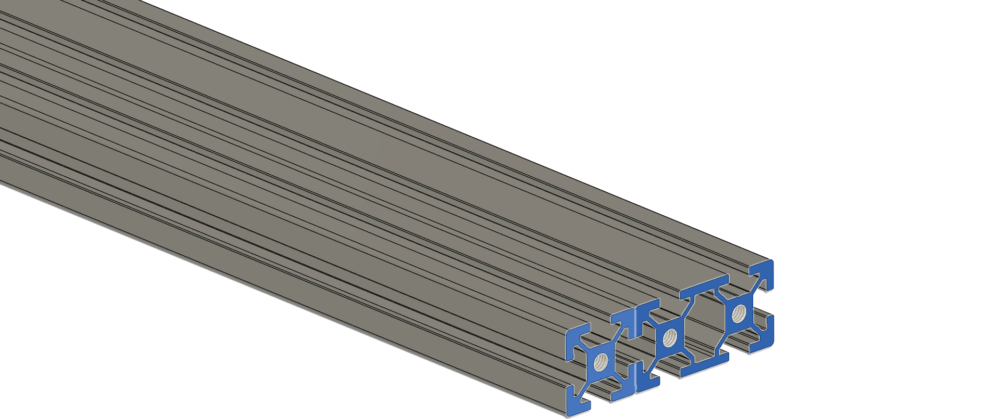

---
layout:
  title:
    visible: true
  description:
    visible: false
  tableOfContents:
    visible: true
  outline:
    visible: true
  pagination:
    visible: true
---

# Building the vertical frame

Place two M5 T-Nuts in the Extrusion marked G (2040).

<figure><figcaption></figcaption></figure>

Add two M5x6 Screws to the T-Nuts you've just added on the G extrusion

<figure><figcaption></figcaption></figure>

Take the G extrusion (2040) and align the screws with the hole spacing on the A extrusion. This step is crucial to ensure access to the screws from the blind joint on extrusion A.

Align the A extrusion with the G extrusion and slide it into place, ensuring the bolt heads fit into the extrusion slot.

Slide the extrusion completely into the final bolt.

<figure><figcaption></figcaption></figure>

Make sure the bottom surfaces are flush.

<figure><figcaption></figcaption></figure>

Tighten the two M5x6 screws on the blind joints


If you're experiencing difficulties with screws moving when sliding the extrusion, ensure they're not overly tightened and are of equal length. You can use a hex key through the drilled hole to help slide the extrusion into place, then remove the key to align the other hole.


Now add a M5 T-Nut and M5x3 screw to A extrusion, this should be inserted on the side that has the G extrusion attached.


These Screw/T-Nut set will later secure the Y extrusion in the build.


\
\
Now repeat these steps another 3 times until you have 4 vertical frame assemblies.

Ensure you now have 4, and proceed to the next step.

